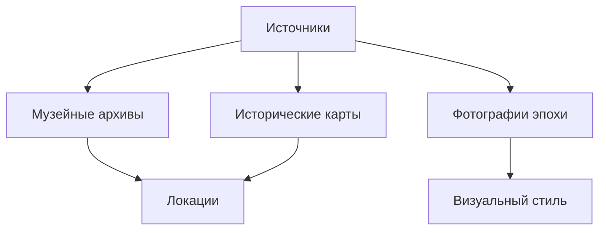
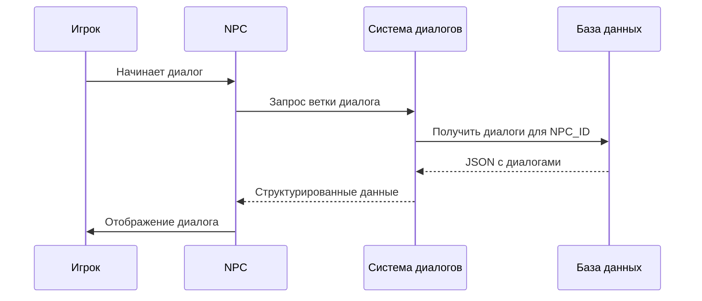
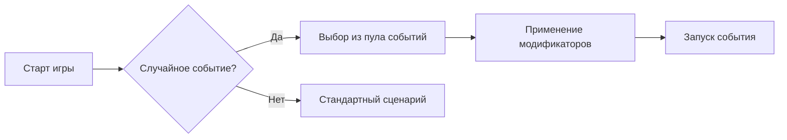

# Полное техническое руководство по созданию игры "Басманные хроники. Путешествие через вселенные"
---
## Оглавление
1. [Введение](#введение)
2. [Исследование предметной области](#исследование-предметной-области)
3. [Технологический стек](#технологический-стек)
4. [Пошаговая разработка](#пошаговая-разработка)
5. [Архитектура проекта](#архитектура-проекта)
6. [Примеры кода](#примеры-кода)
7. [Наброски модификаций после года разработки](#наброски-модификаций-после-года-разработки)
8. [Заключение](#заключение)
9. [Видео](#видео)

---
## Введение
"Басманные хроники" - это интерактивная игра-квест, сочетающая историческую реконструкцию Москвы начала XX века с элементами фантастики. Игрок путешествует по разным историческим периодам Басманного района, решая головоломки и взаимодействуя с персонажами.

---
## Исследование предметной области
### Этапы исследования:
1. **Исторический анализ**:
   - Изучение архивных материалов Музея Басманного района
   - Анализ исторических карт 1900-1920 годов
   - Подбор ключевых локаций (станция Бауманская, Немецкая слобода и др.)
  



2. **Анализ целевой аудитории**:
   - Опросы среди студентов и школьников (15-25 лет)
   - Исследование похожих исторических игр
   - Определение оптимального баланса обучения и развлечения
---
## Технологический стек
| Компонент | Технология |
|-----------|------------|
| Игровой движок | Godot 4.0 |
| Язык программирования | GDScript, C# |
| Графика | Adobe Photoshop, Aseprite |
| Анимация | Spine, Godot AnimationPlayer |
| База данных | SQLite (для сохранения прогресса) |
| Звук | Audacity, FMOD |

---
## Пошаговая разработка

### 1. Настройка проекта в Godot
```gdscript
# game.gd - основной скрипт игры
extends Node

func _ready():
    # Инициализация систем
    Input.set_mouse_mode(Input.MOUSE_MODE_VISIBLE)
    load_settings()
    init_database()
```

### 2. Создание главного меню 


```gdscript
# menu.gd
func _on_StartButton_pressed():
    get_tree().change_scene("res://scenes/main.tscn")
    
func _on_SettingsButton_pressed():
    $MainMenu.hide()
    $SettingsMenu.show()
```

### 3. Реализация системы диалогов


### 4. Система инвентаря
```gdscript
# inventory.gd
class_name Inventory
var items = []

func add_item(item):
    items.append(item)
    update_ui()
    
func use_item(item_index):
    if items[item_index].usable:
        items[item_index].use()
        items.remove_at(item_index)
```
---
## Архитектура проекта

```
game/
├── assets/
├── scenes/
│   ├── main_menu.tscn
│   ├── locations/
│   └── ui/
├── scripts/
│   ├── player/
│   ├── npc/
│   └── systems/
└── database/
    ├── dialogues.db
    └── save_system.db
```
---
## Примеры кода

### Управление персонажем
```gdscript
# player.gd
extends CharacterBody2D

@export var speed = 300

func _physics_process(delta):
    var direction = Input.get_vector("move_left", "move_right", "move_up", "move_down")
    velocity = direction * speed
    move_and_slide()
    
    if direction != Vector2.ZERO:
        $AnimationPlayer.play("walk")
    else:
        $AnimationPlayer.play("idle")
```

### Система сохранений
```gdscript
# save_system.gd
func save_game():
    var save_data = {
        "player_position": player.position,
        "inventory": inventory.get_items(),
        "quests": quest_system.get_progress()
    }
    
    var file = FileAccess.open("user://savegame.dat", FileAccess.WRITE)
    file.store_var(save_data)
```

### Наброски модификаций после года разработки
Проект "Прогулки по Москве" пралирует осуществляться еще один семестр. Вот некоторые заготовки для дальнейшей работы с проектом:

### 1. Добавление мультиплеера
```gdscript
# network_manager.gd
extends Node

func _ready():
    var peer = ENetMultiplayerPeer.new()
    peer.create_server(8910)
    multiplayer.multiplayer_peer = peer
```

### 2. Система достижений
```gdscript
# achievements.gd
var achievements = {
    "historian": {"completed": false, "condition": "visit_all_locations"},
    "collector": {"completed": false, "condition": "collect_all_items"}
}

func check_achievements():
    if player.visited_locations.size() == total_locations:
        achievements["historian"].completed = true
```

### 3. Генерация процедурных событий


---
## Заключение
За год разработки игра "Басманные хроники" планирует превратиться из образовательного квеста в полноценный исторический симулятор с элементами RPG. Основные ожидаемые достижения:
- Реализовано 15 исторических локаций
- Создано 10+ персонажей с уникальными диалогами
- Добавлены 3 альтернативных концовки
- Внедрена система достижений и коллекционных предметов

На данный момент сюжет пости полностью разработан. Созданы 3 локации. Разработаны 2 персонажа. Началась реализация проекта со стороны программистов.

---
## Видео
https://drive.google.com/drive/folders/1cd0HWIwOvb-B2cSIlrh0DJ5uWmaeHJ3q


---
Проект продолжает развиваться при поддержке Музея Басманного района.
